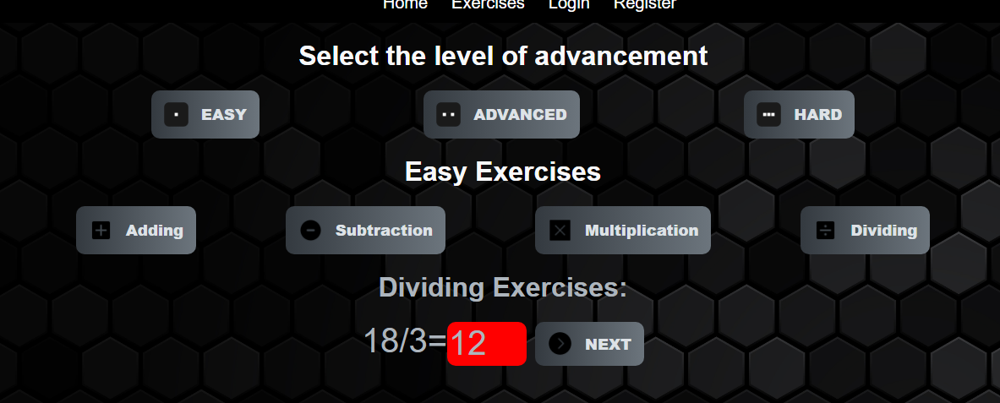

# Math Learning

Simple app for learning math using react and django rest api

## How to run

1.  Install python 3.12 on your computer when installing, check add path to python

2.  Install Node.js on Your Computer

3.  install mysqlserver on your computer and mysqlworkbeanch or similar program

4.  Clone repo git-clone https://github.com/LukiOoO/Math-Lerning-repo.git

5.  in Mysql Server Create a database named math_learning and import the data from the file math_learning_database.sql into it

6.  In the dev.py file located at math_lerning_backend > math_lerning_backend > settings > dev.py in DATABASES, replace haslo123 with your Mysql server password provided at setup.

        DATABASES = {
        'default': {
        'ENGINE': 'django.db.backends.mysql',
        'NAME': 'math_learning',
        'HOST': 'localhost',
        'USER': 'root',
        'PASSWORD': 'Your Password'
        }
        }

7.  Install python in extensions in visual studio code

8.  Install pipenv by typing pip install pipenv in cmd

9.  in the visual studio code terminal, go to Your Location \Math-Lerning-repo\math_lerning_backend and type pipenv install after instalation type pipenv shell

10. in the visual studio code terminal, in Your Location \Math-Lerning-repo\math_lerning_backend, type pipenv install django-cors-headers

11. By clicking Ctrl + shift + p, open the commend palette and type Python: Select Interpreter and select the pipenv environment created step above

12. to run server backend type in visual studio terminal code in Your Location \Math-Lerning-repo\math_lerning_backend

python manage.py runserver

    If everything ran successfully you should get something like this

        System check identified no issues (0 silenced).
        March 05, 2023 - 17:00:24
        Django version 4.1.7, using settings 'math_lerning_backend.settings.dev'
        Starting development server at http://127.0.0.1:8000/
        Quit the server with CTRL-BREAK

13. without closing the previously opened termianl, open a new terminal and go to the location of your LocalizationMath-Lerning-repo\math_learning_frontend>.  
    make sure you haven't opened a terminal with pipenv enabled if you have, type deactivate And type npm i

14. to start the server frontend type npm start and you should open a window with a properly working application

# Detailed Description:

## Home
Site displays player ranking points are earned on tests 

### Home page after login

After logging in/creating an account, the home page shows a box with the user's name points and rank. The rank system is also displayed

## Exercises
The page contains options for doing math exercises addition subtraction division and multiplication at 3 levels of difficulty after entering the correct value the box is highlighted in green and otherwise the window is highlighted in red. After clicking next the next exercise is shown

## Login 
Under the login tab, you can log in to the account you created 

## Register
In the register tab you can create an account fields are covered by simple validation

## Test
Tests just like exercises are available in three different levels of difficulty the harder the level the more points the player gets. The test consists of 10 questions after the test displays the number of positive answers and errors

## User profile
The user profile tab shows the user's recent tests and gives the ability to change the account password

